<div align="center">

# Converso — *Learn it out loud.*

**Real-time AI voice tutors for every subject.** Build a companion, pick its voice and personality, then just talk — it explains, asks you questions back, and keeps a transcript of every session.


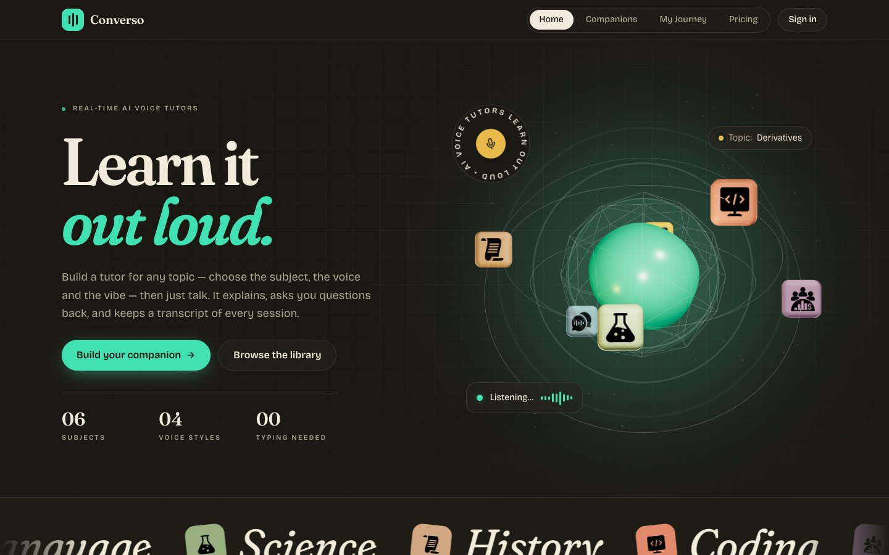

</div>

---

## Table of contents

1. [Screenshots](#-screenshots)
   - [Landing page](#landing-page)
   - [Companion library](#companion-library)
   - [Pricing](#pricing)
   - [Sign in](#sign-in)
   - [Mobile](#mobile)
2. [Project summary](#-project-summary)
   - [Features](#features)
   - [How a voice session works](#how-a-voice-session-works)
   - [Design](#design)
   - [Tech stack](#tech-stack)
   - [Architecture](#architecture)
   - [Project structure](#project-structure)
   - [Database schema](#database-schema)
3. [Installation guide](#-installation-guide)

---

## 📸 Screenshots

### Landing page

**Hero** — an interactive Three.js scene: a "voice orb" sending out sound ripples, circled by six subject badges on orbit lines. Move the pointer to tilt it, click the orb to make it pulse, or click a badge to open that subject in the library.


**Subject ticker & popular companions** — a two-row marquee of subjects (hover to pause, click to filter), followed by live companion cards styled as vintage book covers.

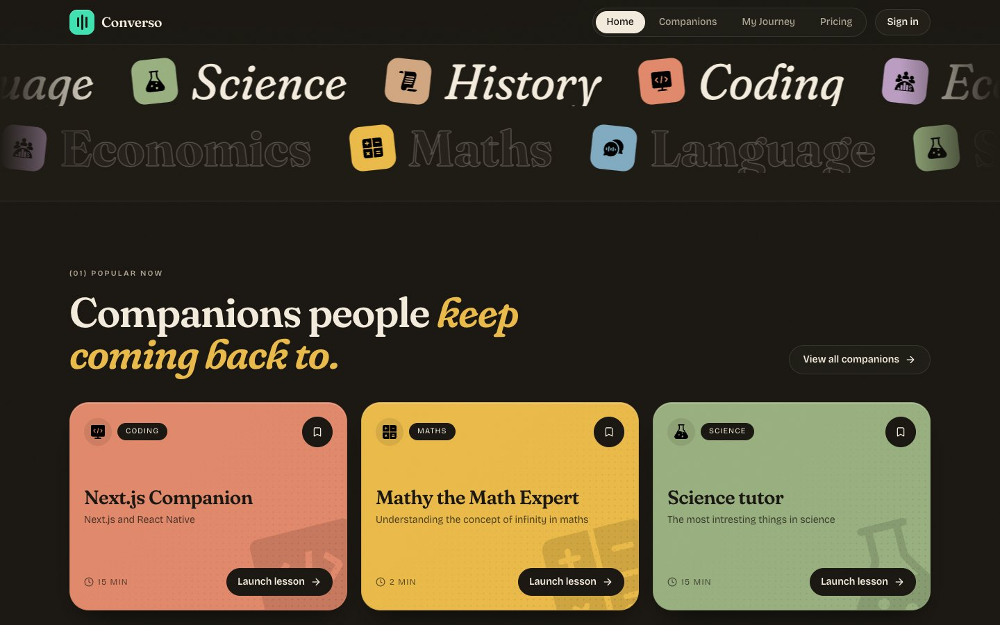

**Manifesto** — the statement lights up word by word as you scroll through it.

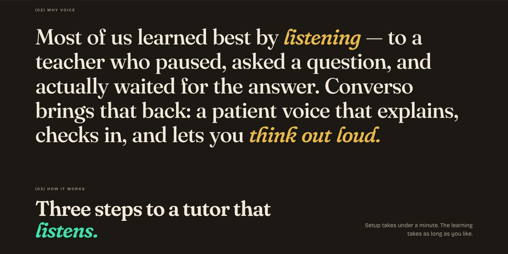

**How it works** — scroll-driven stacking cards: as each step slides up, the cards behind it shrink and dim into a pile.

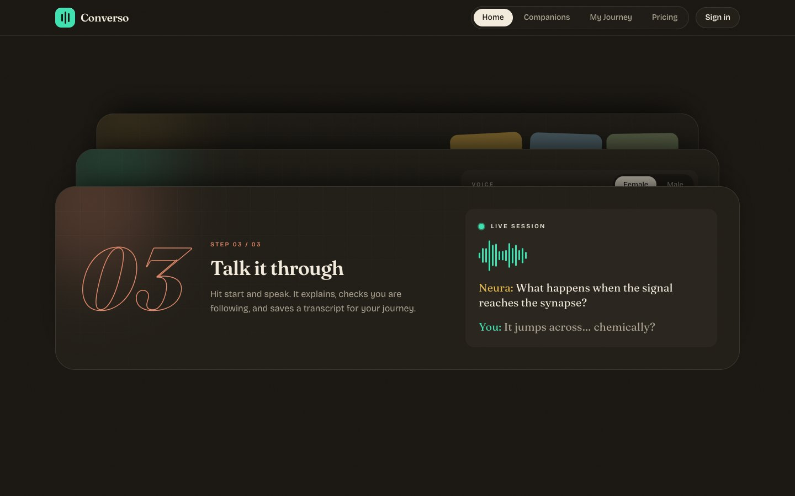

**Recently completed sessions & call to action** — recent sessions from across the platform, next to a prompt to build your own companion.

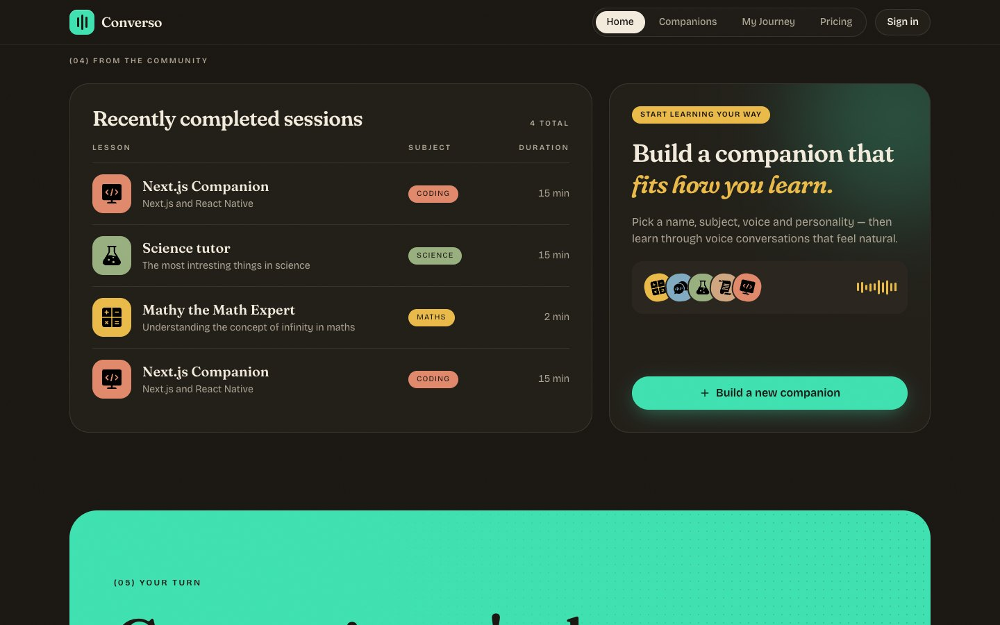

**Closing call to action**

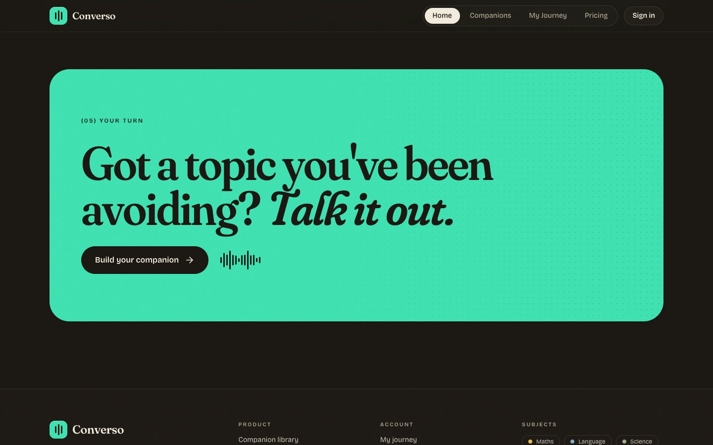

**Footer**

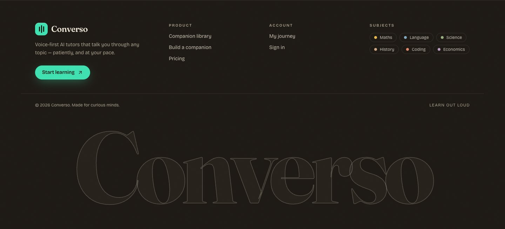

### Companion library

Search by topic or name (debounced, synced to the URL) and filter by subject. Every card can be bookmarked.

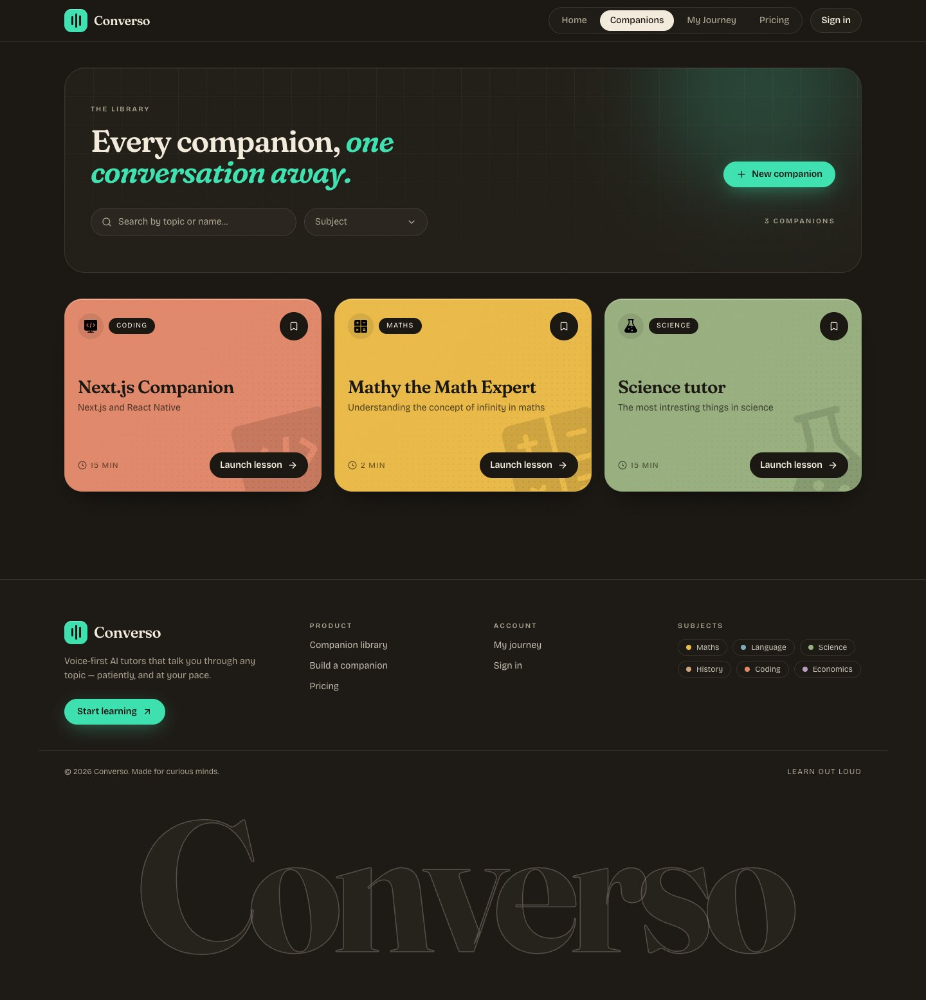

**Filtered by subject** — `/companions?subject=maths`

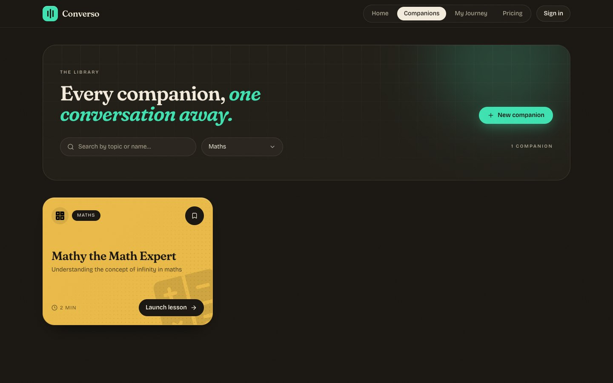

### Pricing

Plans and checkout are handled by Clerk Billing, themed to match the app.

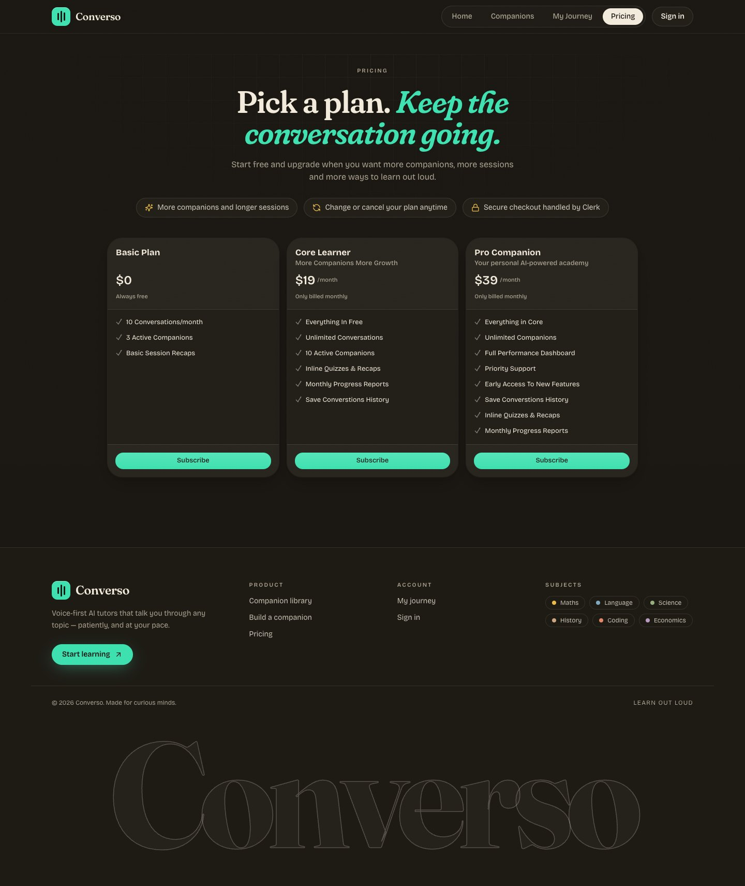

### Sign in

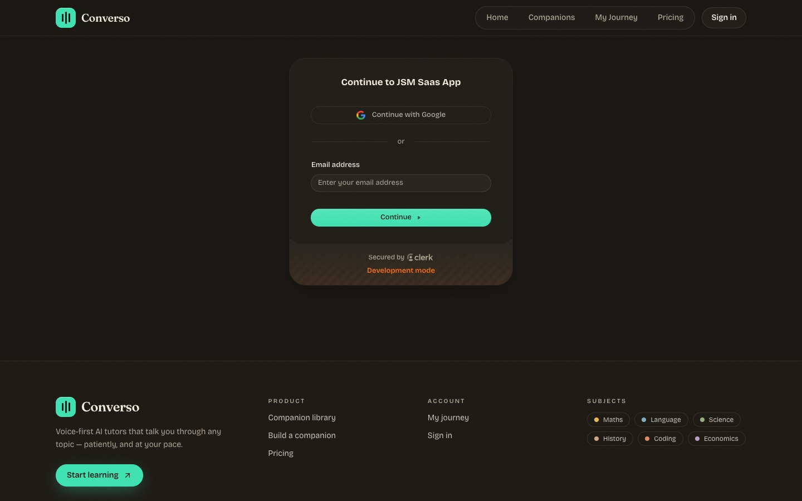

### Mobile

Fully responsive down to 320px, with a dedicated mobile menu, full-width actions, 44px touch targets, and the stacking cards resized to fit a phone screen.

<table>
  <tr>
    <td align="center">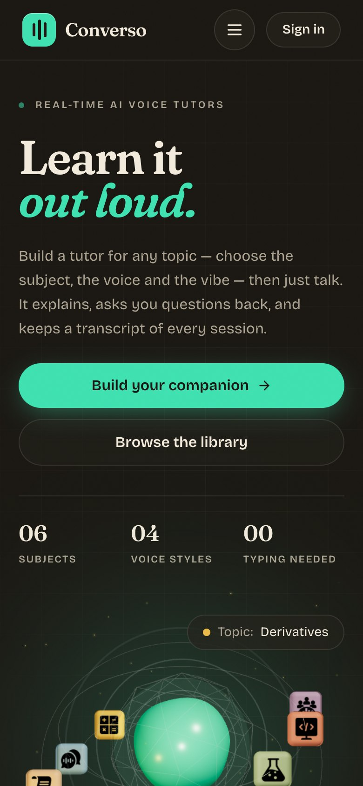<br><sub>Hero</sub></td>
    <td align="center">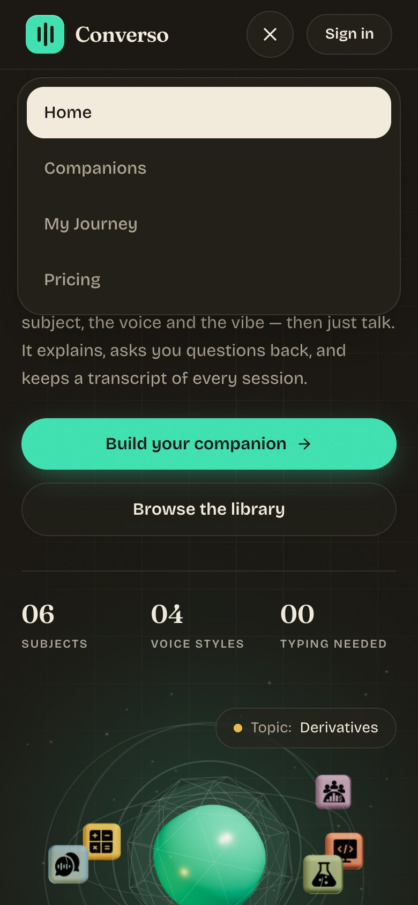<br><sub>Menu</sub></td>
    <td align="center">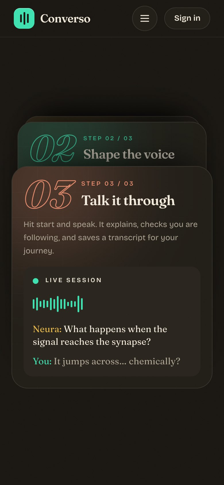<br><sub>How it works</sub></td>
  </tr>
  <tr>
    <td align="center">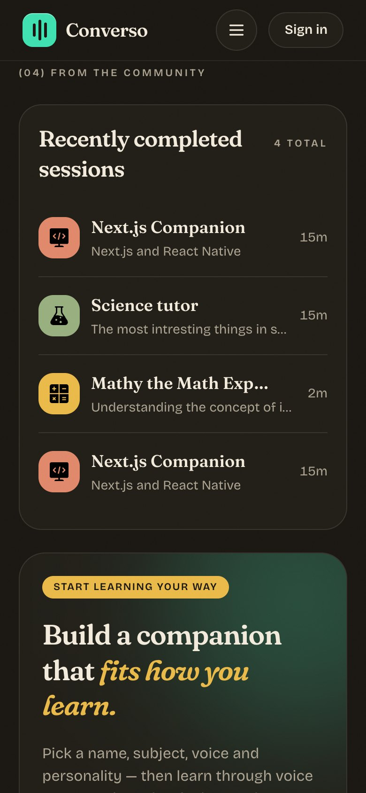<br><sub>Recent sessions</sub></td>
    <td align="center">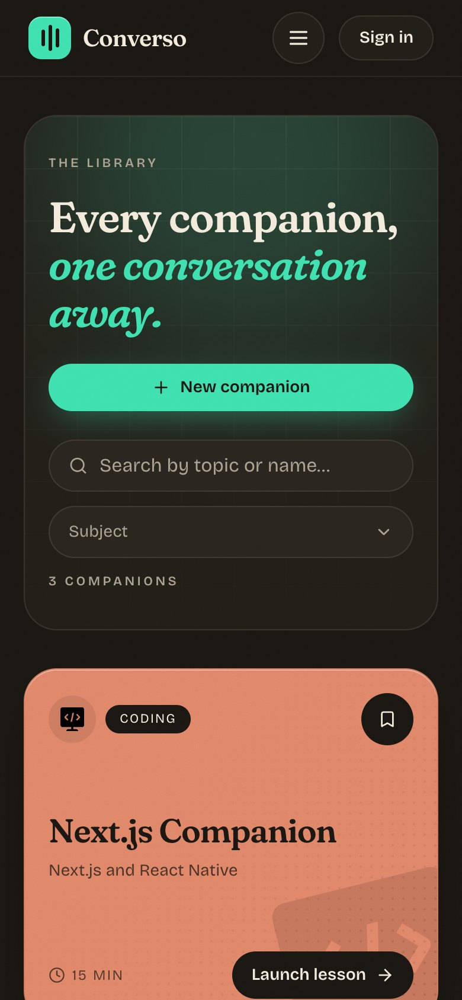<br><sub>Library</sub></td>
    <td align="center">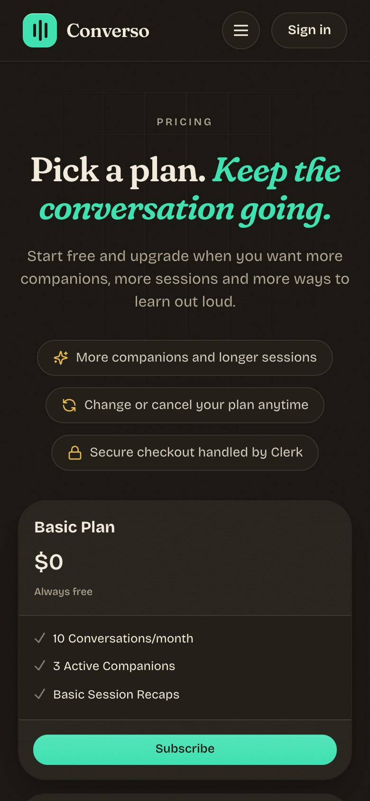<br><sub>Pricing</sub></td>
  </tr>
</table>

---

## 🧭 Project summary

Converso is a SaaS learning platform where every tutor is a **voice**. Instead of reading or typing, you hold a real-time spoken conversation with an AI "companion" that you configured yourself — its subject, the exact topic, its voice, its speaking style and the session length. The companion explains the topic, checks that you are following, and saves the transcript so you can come back to it in your journey.

It is built with the Next.js App Router, uses **Clerk** for authentication and subscription billing, **Supabase** (Postgres) for data, and **Vapi** for the real-time voice pipeline.

### Features

| Area | What it does |
|---|---|
| **Companion builder** | A validated form (React Hook Form + Zod) to create a tutor: name, subject, topic, voice (male/female), style (formal/casual) and duration. |
| **Real-time voice sessions** | Talk to a companion through Vapi. Live transcript, mute/unmute, speaking indicator with a Lottie soundwave, and session history saved when a call ends. |
| **Companion library** | Browse every companion with debounced search (by topic or name) and a subject filter, both reflected in the URL. |
| **Bookmarks** | Bookmark any companion from its card. Optimistic UI — the icon flips instantly and rolls back if the save fails. |
| **My Journey** | A profile page with lessons completed, companions created, bookmarks, and collapsible lists of each. |
| **Subscriptions** | Clerk Billing plans. The number of companions you can create depends on your plan (`pro` = unlimited; features `3_companion_limit` / `10_companion_limit`). |
| **Authentication** | Clerk sign-in (email + Google), protected routes via `clerkMiddleware`, and a Clerk-signed token passed to Supabase on every query. |
| **Row Level Security** | Supabase verifies Clerk's token and enforces per-user access in the database itself. |
| **Interactive landing page** | Three.js hero, scroll-lit manifesto, scroll-driven stacking cards, marquee, and scroll reveals — all respecting `prefers-reduced-motion`. |
| **Monitoring** | Sentry error and performance monitoring. |

### How a voice session works

1. You open a companion — `app/companions/[id]` loads it on the server and checks you are signed in.
2. **Start session** calls `vapi.start()` with an assistant built by `configureAssistant()` in `lib/utils.ts` — Deepgram for speech-to-text, OpenAI for the model, ElevenLabs for the voice — plus overrides for the subject, topic and style.
3. Vapi streams events back: `speech-start` / `speech-end` drive the speaking animation, and final `transcript` messages are appended to the on-screen transcript.
4. When the call ends, `addToSessionHistory()` records the session in Supabase, so it appears in *Recently completed sessions* and in *My Journey*.

### Design

A warm, "midnight study hall" dark theme with an old-school print feel.

- **Palette** — warm ink background (`#1B1813`), cream text (`#F2EADB`), and an electric mint accent (`#3FE0B0`).
- **Subject colours** — vintage textbook-cover tones, defined once in `constants/index.ts`:

  | Maths | Language | Science | History | Coding | Economics |
  |:-:|:-:|:-:|:-:|:-:|:-:|
  | `#E9B949` mustard | `#7FA9BF` dusty blue | `#97AE7E` sage | `#CFA57F` sepia | `#E0876A` terracotta | `#B99BC0` mauve |

- **Type** — *Fraunces* (a soft, slightly wonky old-style serif) for headlines, *Bricolage Grotesque* for everything else.
- **Texture** — a subtle film-grain overlay, graph-paper grids and halftone dots on the cards.
- **Accessibility** — visible focus rings, labelled icon buttons, a described 3D canvas, and all animation disabled under `prefers-reduced-motion`.

### Tech stack

| Layer | Technology |
|---|---|
| Framework | [Next.js](https://nextjs.org) 15 (App Router, Turbopack), React 19, TypeScript |
| Styling | [Tailwind CSS](https://tailwindcss.com) v4, [shadcn/ui](https://ui.shadcn.com) components (Base UI), `lucide-react` icons |
| Auth & billing | [Clerk](https://clerk.com) (`@clerk/nextjs`, `@clerk/themes`) |
| Database | [Supabase](https://supabase.com) Postgres + Row Level Security (`@supabase/supabase-js`) |
| Voice AI | [Vapi](https://vapi.ai) (`@vapi-ai/web`) |
| Forms | React Hook Form + Zod |
| 3D & motion | [Three.js](https://threejs.org), React Three Fiber, Drei, [Motion](https://motion.dev), Lottie |
| Monitoring | [Sentry](https://sentry.io) |

### Architecture

Clerk and Supabase never talk to each other directly. Supabase is configured to trust tokens signed by Clerk, and the user carries that token with every request.

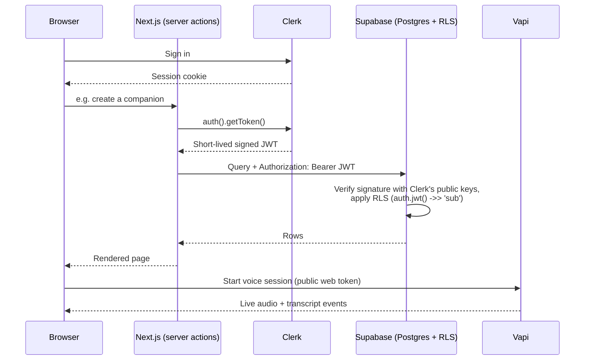
```mermaid
sequenceDiagram
    participant U as Browser
    participant N as Next.js (server actions)
    participant C as Clerk
    participant S as Supabase (Postgres + RLS)
    participant V as Vapi

    U->>C: Sign in
    C-->>U: Session cookie
    U->>N: e.g. create a companion
    N->>C: auth().getToken()
    C-->>N: Short-lived signed JWT
    N->>S: Query + Authorization: Bearer JWT
    S->>S: Verify signature with Clerk's public keys,<br/>apply RLS (auth.jwt() ->> 'sub')
    S-->>N: Rows
    N-->>U: Rendered page
    U->>V: Start voice session (public web token)
    V-->>U: Live audio + transcript events
```

The key line is in `lib/supabase.ts` — `accessToken()` runs before every Supabase query and attaches a fresh Clerk token.

### Project structure

```
.
├── app/
│   ├── page.tsx                      # Landing page
│   ├── layout.tsx                    # Fonts, Clerk provider + theme, navbar, footer
│   ├── globals.css                   # Design tokens and shared component styles
│   ├── companions/
│   │   ├── page.tsx                  # Library with search + subject filter
│   │   ├── new/page.tsx              # Companion builder (plan limits enforced)
│   │   └── [id]/page.tsx             # Live voice session
│   ├── my-journey/page.tsx           # Profile, stats, bookmarks, history
│   ├── subscription/page.tsx         # Clerk pricing table
│   └── sign-in/[[...sign-in]]/       # Clerk sign-in (catch-all for its sub-steps)
├── components/
│   ├── landing/                      # Hero 3D scene, marquee, manifesto, stacking cards, CTA
│   ├── ui/                           # shadcn/ui primitives
│   ├── CompanionCard.tsx             # Card with optimistic bookmark toggle
│   ├── CompanionComponent.tsx        # Voice session UI (Vapi)
│   ├── CompanionForm.tsx             # Builder form (React Hook Form + Zod)
│   ├── CompanioinsList.tsx           # Responsive session / companion list
│   └── Navbar.tsx, NavItems.tsx, Footer.tsx, Searchinput.tsx, SubjectFilter.tsx, …
├── lib/
│   ├── actions/companion.actions.ts  # Server actions: CRUD, sessions, bookmarks, plan limits
│   ├── supabase.ts                   # Supabase client that forwards the Clerk token
│   ├── vapi.sdk.ts                   # Vapi client
│   └── utils.ts                      # cn(), subject colours, Vapi assistant config
├── constants/                        # Subjects, subject colours, voices, Lottie data
├── types/                            # Shared TypeScript types
├── middleware.ts                     # clerkMiddleware()
└── docs/screenshots/                 # Images used in this README
```

### Database schema

Three tables in the `public` schema. Clerk user IDs (`user_…`) are stored as `text`.

| Table | Columns | Purpose |
|---|---|---|
| `companions` | `id`, `created_at`, `name`, `subject`, `topic`, `voice`, `style`, `duration`, `author` | The tutors. `author` is the Clerk user ID of whoever built it. |
| `session_history` | `id`, `created_at`, `companion_id → companions.id`, `user_id` | One row per finished voice session. |
| `bookmarks` | `id`, `created_at`, `companion_id → companions.id`, `user_id` | A user's saved companions. |

The foreign keys matter: the app's queries use `select('companions:companion_id (*)')` to pull in the related companion, which only works when Supabase knows about the relationship. The full setup SQL is in the installation guide below.

**Acknowledgement:** this project began from the [JavaScript Mastery "SaaS App" course](https://youtu.be/XUkNR-JfHwo) ([reference repo](https://github.com/adrianhajdin/saas-app)) and was extended with a full redesign, the Three.js landing page, working bookmark state, mobile layouts and a number of fixes.

---

## 🛠 Installation guide

### 1. Prerequisites

- **Node.js 20+** and npm
- Free accounts on **[Clerk](https://dashboard.clerk.com)**, **[Supabase](https://supabase.com/dashboard)** and **[Vapi](https://dashboard.vapi.ai)**
- *(Optional)* a **[Sentry](https://sentry.io)** account for error monitoring

### 2. Clone and install

```bash
git clone https://github.com/SohamV25/JSM-Saas-Platform.git
cd JSM-Saas-Platform
npm install
```

### 3. Environment variables

```bash
cp .env.example .env.local
```

Then fill in `.env.local`:

| Variable | Where to find it |
|---|---|
| `NEXT_PUBLIC_CLERK_PUBLISHABLE_KEY` | Clerk dashboard → **API Keys** |
| `CLERK_SECRET_KEY` | Clerk dashboard → **API Keys** |
| `NEXT_PUBLIC_CLERK_SIGN_IN_URL` | Leave as `/sign-in` |
| `NEXT_PUBLIC_CLERK_SIGN_IN_FALLBACK_REDIRECT_URL` | Leave as `/` |
| `NEXT_PUBLIC_CLERK_SIGN_UP_FALLBACK_REDIRECT_URL` | Leave as `/` |
| `NEXT_PUBLIC_SUPABASE_URL` | Supabase → **Project Settings → API** → Project URL |
| `NEXT_PUBLIC_SUPABASE_ANON_KEY` | Supabase → **Project Settings → API** → anon / publishable key |
| `NEXT_PUBLIC_VAPI_WEB_TOKEN` | Vapi dashboard → **API Keys** → public key |
| `SENTRY_AUTH_TOKEN` | *(Optional)* Sentry → **Settings → Auth Tokens** |

> `.env.local` is git-ignored — never commit it. Only `.env.example`, which has no values, is tracked.

### 4. Set up Clerk

1. Create an application and enable **Email** and **Google** sign-in.
2. **Connect Clerk to Supabase:** Clerk dashboard → **Configure → Integrations → Supabase** → enable it and copy your **Clerk domain** (it looks like `https://your-app.clerk.accounts.dev`).
3. **Billing (for the pricing page and plan limits):** Clerk dashboard → **Billing** → create your plans. The code checks for:
   - a plan with the key **`pro`** — unlimited companions
   - a feature **`3_companion_limit`** and a feature **`10_companion_limit`** — attach these to your lower plans

   Users without any of these can't create companions — the builder shows an upgrade prompt instead.

### 5. Set up Supabase

1. **Trust Clerk's tokens:** Supabase dashboard → **Authentication → Sign In / Providers → Third Party Auth → Add provider → Clerk**, and paste the Clerk domain from step 4.2.

   > If you skip this, every signed-in query fails with **"No suitable key or wrong key type"** — Supabase has no key to verify Clerk's signature.

2. **Create the tables and policies:** Supabase dashboard → **SQL Editor** → run:

```sql
-- Companions (the tutors)
create table public.companions (
  id          uuid primary key default gen_random_uuid(),
  created_at  timestamptz not null default now(),
  name        text not null,
  subject     text not null,
  topic       text not null,
  voice       text not null,
  style       text not null,
  duration    integer not null,
  author      text not null
);

-- One row per finished voice session
create table public.session_history (
  id           uuid primary key default gen_random_uuid(),
  created_at   timestamptz not null default now(),
  companion_id uuid not null references public.companions(id) on delete cascade,
  user_id      text not null
);

-- Saved companions
create table public.bookmarks (
  id           uuid primary key default gen_random_uuid(),
  created_at   timestamptz not null default now(),
  companion_id uuid not null references public.companions(id) on delete cascade,
  user_id      text not null
);

alter table public.companions      enable row level security;
alter table public.session_history enable row level security;
alter table public.bookmarks       enable row level security;

-- Anyone can browse companions and recent sessions (the landing page shows them signed out)
create policy "Companions are public"      on public.companions      for select to anon, authenticated using (true);
create policy "Sessions are public"        on public.session_history for select to anon, authenticated using (true);

-- Signed-in users can only write rows that belong to them.
-- auth.jwt() ->> 'sub' is the Clerk user ID carried in the token.
create policy "Create own companions"      on public.companions      for insert to authenticated
  with check (author = (select auth.jwt() ->> 'sub'));
create policy "Record own sessions"        on public.session_history for insert to authenticated
  with check (user_id = (select auth.jwt() ->> 'sub'));
create policy "Manage own bookmarks"       on public.bookmarks       for all    to authenticated
  using      (user_id = (select auth.jwt() ->> 'sub'))
  with check (user_id = (select auth.jwt() ->> 'sub'));

notify pgrst, 'reload schema';
```

### 6. Set up Vapi

1. Create a Vapi account and copy your **public** key into `NEXT_PUBLIC_VAPI_WEB_TOKEN`.
2. The assistant is configured in code (`configureAssistant()` in `lib/utils.ts`) — Deepgram `nova-3` transcription, OpenAI `gpt-4`, and ElevenLabs voices whose IDs live in `constants/index.ts` under `voices`. Swap those IDs to use different voices.

### 7. Run it

```bash
npm run dev
```

Open **http://localhost:3000**.

| Script | What it does |
|---|---|
| `npm run dev` | Start the dev server with Turbopack |
| `npm run build` | Production build (type-checks and lints) |
| `npm run start` | Serve the production build |
| `npm run lint` | Run ESLint |

### 8. Deploy

The app deploys to [Vercel](https://vercel.com) as-is: import the repository, add the same environment variables in the project settings, and deploy. In Clerk, switch to a production instance and use its keys, then add the production Clerk domain to Supabase's Third Party Auth as well.

### Troubleshooting

| Symptom | Fix |
|---|---|
| `No suitable key or wrong key type` | Supabase isn't trusting Clerk yet — complete step 5.1. |
| `Could not find the table 'public.…' in the schema cache` | A table is missing — run the SQL in step 5.2. |
| `Could not find a relationship between …` | The `companion_id` foreign key is missing — recreate the table with `references public.companions(id)`. |
| `daily-js version … is no longer supported` | Update the voice SDK: `npm install @vapi-ai/web@latest`. |
| Strange Turbopack errors after installing packages | Stop the dev server, run `rm -rf .next`, and start it again. |
| Can't create a companion | Your Clerk user has no plan or companion-limit feature — see step 4.3. |
